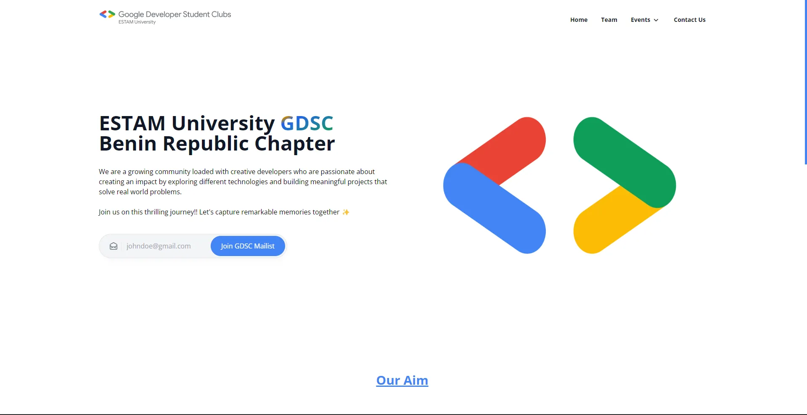

# GDSC ESTAM Website

The **GDSC ESTAM Website** is a platform designed to showcase the objectives and activities of the Google Developer Student Clubs (GDSC) at ESTAM University. It’s built with **React.js**, **Tailwind CSS** and hosted using **Firebase**.

## Recognition
Logo Animation by [Zsolt Pajan](https://dribbble.com/shots/3076875-Google-Developers-logo-animation-concept)

## Features

- **Home**: About and all that is needed to know about GDSC
- **Team**: The core team of your GDSC branch
- **Events**: Upcoming and Past Events
- **Contact Us**: Contact Page for comunity members to reach out
- **Archive**: [On_Comment] for past leaders of your school branch on GDSC
- **Blog**: [Later] to be added for the entire community to see your past events and news about upcoing events etc.

## Demo

You can visit the live version of the website [here](https://gdscestam.web.app/).



## Table of Contents

1. [Installation](#installation)
2. [Usage](#usage)
3. [Deployment](#deployment)
4. [Contributing](#contributing)
5. [License](#license)
6. [Acknowledgments](#acknowledgments)
6. [Contact](#contact)

## Installation

To set up this project locally, follow these steps:

### Prerequisites

- **Node.js** (v18.x or higher)
- **npm** (v6.x or higher)
- **firebase**

### Steps

1. **Clone the repository**:
   ```bash
   git clone https://github.com/GDSC-Estam/gdscestamui.git

2. **Navigate to the project directory**
    ```bash
    cd gdscestamui

3. **Install Dependencies**
    ```bash
    npm install or yarn install

4. **Set up your firebase hosting**
    ```bash
    npm install -g firebase-tools


## Usage

To check the project locally while developing or making changes

### Steps

1. **Run the development server:**
    ```bash 
    npm start

2. **Build for production:**
    ```bash
    npm run build

3. **Init the Firebase**
    ```bash
    firebase init hosting

4. **select all the necessary informations**
    ```bash
    your output file name should be 'build'


## Deployment

This project is hosted on Firebase Hosting. You can deploy the site using Firebase by following these steps:

### Steps

1. **Build the production files:**
    ```bash 
    npm run build

2. **Deploy to Firebase:**
    ```bash
    firebase deploy


## Contributing

We welcome contributions! Please follow these steps to contribute:

### Steps

1. **Fork the repository or you can clone**

## License

This project is licensed under the MIT License - see the [LICENSE](./LICENSE) file for details.


## Acknowledgments

- React Icons, Hero Icons and Headlessui: were used for icons.
- Firebase: For hosting our project.
- Lottie: For the animations that enhance user engagement.
- Google Developer Student Clubs (GDSC): For supporting students in tech communities.


## Contact

If you have any questions, feel free to open an issue or contact us at gdscestam@gmail.com
